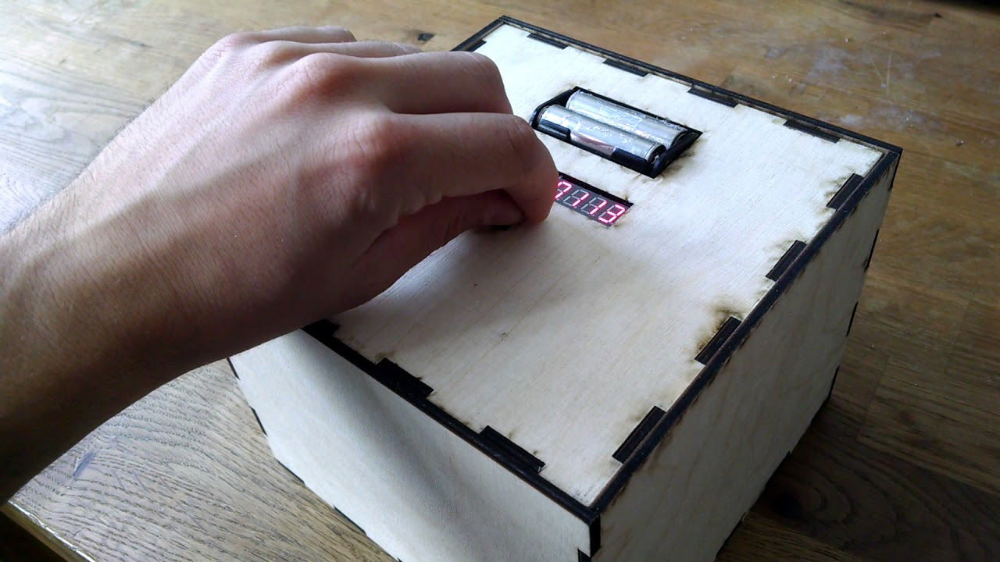

# Delayed Gratification Actuator 

Extended Documentation by Maximilian Wolfs

Course: Digital Artifactual Objections
Lecturer: Dennis Paul
Term: Winter Term 17/18

## Concept

> Because today's ultra-fast cycle rates being first above being right.
> It tells us what's happening in real time, but rarely what it means.
> Industrial design between extreme pain and pleasure, Asceticism and decadence.

Digital Technology is developing faster and is sucking us more and more into a continuous on demand, flexible and dynamic environment. Services and Products are delivered faster and Digital Content is almost accessible immediately. In times of [Sofortness](https://de.wikipedia.org/wiki/Sofortness) the ability of self-control is becoming less used but at the same time more important. *Why*? 

How does this shape us and our relation to things and how does the ubiquity of digital services shape our expectations on matter and material culture? The Delayed Gratification Actuator is a time capsule, exploring these boundaries between the user and the paranoid user suggested by the product, entering a psychological adventure by addressing the darker, conceptual models of need that are usually limited.


The Delayed Gratification Actuator is a monolithic product to examine the relation between things - especially their meaning - to their owners. It consists of a dumb container to put things in and a smart lid with a minimalist interface to set the date when the box will open again in the future. Once it’s closed the control Interface is locked within the container and the only remaining action from outside is to press the top button to see how much time is left, until it will open. The aesthetics of the latest prototype aim to a monolithic, out of time object without any ornamental details to evoke a world of fantasy and fiction, blurring distinctions between everyday life and the hyper-reality of advertising and branding.

Normal Product Design has its emphasis on easy pleasure. This wants object forces Aesthetic Disturbance by Design. The intended criticial design approach according to Anthony Dunne and Fiona Raby reinforces the status quo – the unfinished. Like a walkman offers different readings of familiar settings, a landscape according to Dunne and Raby, we are surrounded by products that give us an illusion of choice and encourage passivity. Like [Anthony Dunne and Fiona Raby](http://www.dunneandraby.co.uk/content/home) proposed:

> Electronic products and services could enrich and expand our experience of everyday life rather than closing it down; they could become a medium for experiencing complex aesthetic situations.

The project tries to focus on how the psychological dimensions of experiences offered through electronic products can be expanded. By referring to the world of product misuse and abuse, where desire overflows its material limits and subverts the function of everyday objects, this product would address the darker, conceptual models of need that are usually limited. 

The Access to what do I want to delay to future? What does the Unaccessability produce? How does it change relations? What happenes when it's there but invisible? 

The user becomes a protagonist and the designer a co-author of the experience, the product creates dilemmas rather than resolving them. By using the Delayed Gratification Actuator the owner explores boundaries between himself and the paranoid user suggested by the product, entering into a psychlogical adventure of desire and time. 

## Prototyping & Development Phase

The prototyping and production process involved a lot of going back and forth and produced a lot of enlightening discussions between fellow students, friends and professors. In general there were major threads that were dependent on each other keeping the form always in change. The static component always has been the described User Experience. 

This had a huge impact on the technical aspects and made the process highly iterative although easy solutions could have made it much more simple. But they would have also compromised the initial concept in ways that would lead to a standard predictable user experience which make it nothing more than a cheesy 9,99$ one-time fun and tease plastic product. Therefore it has been very important to strengthen and defend the concept throughout the process which resulted in a strong passion. It was a fine line in the initial pitch in the course and stayed like that through the whole project in discussions, the exhibition, peaking at the Hochschulpreis Jury presenation in 2018 and leading to the temporary end with the 2nd place HEC stipend application. 

### Form and Appearence – UX and UI

How should an object for storing things of meaning for a longer amount of time look like? I started to draw and came to the conclusion that it should have a form that is easy accessible. A simple box that locks. This logic resulted in unofficial working title of the project – Lox. 

__TODO: Photos of Drawings__

The Dimensions of the box were lay-outed were the constraints that it should be able to inherit at least one box of 600g pack of Gewürzspekulatius and the maximum size was set by the possibilities of the workshop tools, specifically laser-cutter and 3d printer.

The next design decision to make was how the locking mechanism integrates with the material. A classic treasure box consists of two parts, integrated together by at least two Hinges. The Lid is then ultimately attached to the container. The other option was a lid and a container that are separate, but with a much more complex and demanding solution to find for how to integrate the locking mechanism and how to open it.

After a lot of thoughts, discussions and sketches I created the first CAD mode in Fusion360 to have a starting point for the production of the first prototype especially with the wood & metal workshop to discuss on something feasible. 

The following drawing has a separate lid which contains all the electronics, locking mechanism and User Interface:


Why Smart Lid?

### 

### Hidden Structures – Electronics & Code

The Program has two states. Is the timer set? If it is, it implies the Lid is closed and the User can only press the top button. Once it is pressed, an interrupt is fired and the micro controller wakes up from the energy saving deep sleep and connects to the real time clock module and asks the current time to calculate the remaining time to the date set by the user. Then the display shows the remaining time for 20seconds. When the display is cleared the micro controller goes back to deep sleep. When the celebration date is reached the micro controller does nothing. Only when the date set by the user is overdue, the timer will be resetted and the code jumps into the celebrate function, which results in a little screen animation and activating the Solenoids. The user is present and can now press down the lid, which opens up. The Solenoid will close again but miss their holes, which enables the user to pull out the whole lid and makes the content and Interface rotary encoder on the bottom of the lid accessable. 

The program is now in its second state – timer not set. It is now possible to push the rotary encoder and set the date for opening the lox in a future date. Once set, the solenoids suck in, letting the user push the lid into the container. When the solenoids push back and the lid is back in the container the LOX is closed and switches the state into TimerSet.


When it comes to the parts. I used an Arduino Nano as main microcontroller. 


__TODO: Flow Chart__


[Link to the Program Code](https://github.com/maxwolfs/Delayed-Gratification-Actuator/tree/master/code/Lox_0.2.ino)


The difficulty was to think algorithmically without a lot of experience in design patterns regarding embedded systems. As with having only experience with reverse engineering in my prior project Crude Data and web development projects, it was hard to research, design and implement the different parts, specifications and libraries to fit it into my concept to become the Delayed Gratification Actuator.


### Iteration 1 – First Prototype

The first wooden model was manufactured out of cheap MDF to get a first feel for the dimensions. 


### Locking Mechanism

With the code being able to set a date, show the remaining time and calling the final function which executes the unlocking mechanism it was finally time to decide on the mechanism itself. Fortunately I already have a tested Solenoid Driver Circuit from the Sound course I’m taking, that i could easily adapt the Mosfet Circuit into the Lox.


In an individual Meeting Prof. Dennis Paul suggested a servo motor that is driving a gear wheel that’s connected to a four axis mechanism which is pulling in and thus release the lock. It’s super nice and smart to use only one motor instead of four or two solenoids but there are two things which I am not convinced by this solution.

1. It takes too much space in the inside of the lid. Especially the positioning of the main gear wheel isn’t possible with the layout of display and the top button. It would have meant to use two layers in the Z dimension. The lid would really thick then and/or resulting in a more complex construction.
2. The sound a servo motor is producing is awful. It’s high pitch sound induces the feeling of a cheap radio controlled toys. Imagine you lock something away for 20 years and then you’ll hear this. No! It must definitely have another sound that connects to a more sublime sonic experience. The Solenoids are cool because their sound of knocking against the wall of the container hiding the things is a nice metaphor too.

But with the decision of Solenoids there is the question which one to take that match my specs of power and are even able to activate the push-push-actuators to open the lid. Solenoids are hard to get and aren’t that cheap. So I basically bought almost every solenoid on Ebay and Amazon available to try them.


### Opening Mechanism

A big question was coming up again and again. How will the opening mechanism actually work? There were a few suggestions that it could be opened with a top handle or carved out holes. But I want to stick with the clean & flat design.

After a thinking it over and over I was holding my pen and clicking it while thinking about. There it was! The pen mechanism: A push-push element as known in drawers. You push them to open and push again to close it and it will stay in its position. I have ordered the cheapest ones from IKEA, but unfortunately they were too big, the spring needs to much force and the range of spring with 80mm was too long to fit in the housing. Custom made solutions were too expensive for a prototype. After thinking for quite a while I thought that it could exploit the mechanism out of pens. I did a few trips to office stores and tested every pen I could find, but there weren’t suitable ones, that matched the requirements, mostly the force momentum.

Then I finally found a rotary push encoder from a test package that came with the EC11 encoders. Perfect! Enough force, decent spring range and small form factor.


Although It worked perfectly well, I wasn't quite satisfied with the perspective of a solution that has not a real perspective for producing a small series of more boxes because of the solution being too "hacky". I applied the new measurements and new positions of the parts to a second drawing and produced a second model where I also switched from Fusion360 to Autodesk Inventor, which allowed me to change dimensions parametrically, especially of linked values more easily than in Fusion360. I also worked a lot in the Institute of Technical Education at the University of Oldenburg because of their new and advanced Laser Cutter which can process materials with 20mm thickness and a nice wood workshop infrastructure to assemble and test the different sizes.


### Iteration 2 – Working Prototype

Besides the opening mechanism another big challenge was the power management and its acessibility. 


to make the batteries accessible. Power Supply and Consumption was a big issue. 

https://www.youtube.com/watch?v=wyVM1x2QQp0&


The lift mechanism is working beautifully! Especially the sound of clicking when opening gives you a nice feeling of quality. It actually makes fun like random clicking on pens.



### Iteration 3 – Major Update

The third Prototype had again major improvements. I built two from which one transformed into the finakl exhibition version. The former solenoids didn't have enough travel to to keep the lid locked in it's wooden container. I switched to bigger solenoids, which needed more power and were heavier. So I also switched from four to two, which were still enough. But they needed a bigger supply voltage which made it necessary to use 4 NiMh cells and a step-up converter which also resulted in a more complex, heavier and more expensive circuit. But it still worked out pretty well with far more solid 12V solenoids and a better working locking mechanism and more satisfying sound.

It was also necessary to have thicker sides of the container for the solenoid pins to dive into. All in all the wooden construction had to be built very precisely in order not to tilt with the lid. Wood was now 12mm poplar.


The original idea was to make the final exhibition version a bronze cast or at least out of metal. 

In an intensive one hour meeting with Prof. Peter von Maydell we disscued about every possible manufacturing solution he could think of. Welding, injection moulding, different 3D printing methods, welding, cold Drawing with metal plates, casting out of concrete and of course possible wooden techniques. It was a big pro and con discussion which resulted in wood being the most affordable and accessible material for the whole prototyping process.

But in order to avoid the DIY lasercut look which push the whole box into a maker context I wanted to have at least a surface, that supports the aesthetic of an out of time artifact. So I ended up with a Bronze Coating made out of Epoxy and real Bronze Powder, which I applied to the surface. The process was really complicated and time consuming, especially the treatment of the final bronze surface with sanding and polishing. But the result was quite good and it looked perfectly as if the whole body was made out of bronze. Also the tactile feeling was cold and hard. As the object was not meant to be held or lifted it was a perfect method not having to spend several hundred euros for 10kg of Bronze in the foundry.


### Iteration 4 – Exhibition Version


[Video](https://vimeo.com/238361982)


## Status Quo

The project has been exhibited twice. First it was part of the group exhbiiton "Digital Artifactual Objections" at FAQ Gallery in Bremen. The second one was at Hochschultage 2018 at the University for the Arts Bremen. In both settings the appearance of the work as aimed towards an out of time artifact with the performative aspect that the timer would end at 9pm. It surpringsingly worked out well at FAQ, that almost 20-30 persons were entering the space and approaching the setup to see what will be inside. 

As a reference for where the original idea came from, the content was an unopened pack of Gewürzspekulatius, which was then opened and consumed. 

The second exhibition at HST 2018 with a jury presentation had also interesting findings. After I introduced and presented the project like in this Introduction I was confronted with the question by the current Curator of the Edith-Ruß-Haus for Media Art that such an object, a safe with a time lock, does already exist and why I build the actually *the same*.

I was pretty surprised by that Question and also a bit sad about what perspective it produced; that my concept and/or narrative didn't connect.

This led me to following insight:

```
The Gap between the concept/narrative of an everyday object and the physical representation of the last prototype aka exhibition version seems to be problematic
```

Therefore my plan was to tackle this gap and follow the path of producing another iteration and also produce small batch of devices to deploy in a field study and stop the path of seeing the object as a exhibitable aura filled art object contextualized through a white cube and exhibition space, even though it had a performative gesture which is also worth to be examined in the first branch.

The only problem was that i ran into the next semester with new courses and also ran out of money because the costs for the prototypes until then had exploded and the upcoming master project seemed to be even more expensive. That's why I connected the further development of the project to the HEC sponsorship 2018 where I had the following plan:

1. resolve mechanical issues and produce a viable prototype for easy reproduction
2. produce a small batch for pilot testing within the field
3. hand it to pilot testers and evaluate the user stories

The aim is to get to a small batch of five prototypes to distribute them to people for pilot testing. For this I want to push to the current prototype to a level where all parts are finalized to iterate the production of more units. With the test phase I want to examine the role of the users and the experience with the object.

* What does it to them? 
* Which Narratives are being developed?
* How does the absence of specific material objects shape their relation to them?

My Roadmap as stated in my HEC Sponsorship application:

| Month | ToDo                                                         |
| ----- | ------------------------------------------------------------ |
| 1     | Finding Final Form and Improvements: Push-Push Actuators, Locking & Opening Mechanism, PCB Layout & Parts |
| 2 - 4 | Production of five prototypes                                |
| 5 - 6 | Test Phase and Evaluation                                    |

The planned Budget for the 

| Position    | Amount    |
| ----------- | --------- |
| PCBs        | 100€      |
| Solenoids   | 100€      |
| Batteries   | 150€      |
| ICs & Parts | 100€      |
| Buttons     | 80€       |
| Displays    | 50€       |
| Mechanics   | 200€      |
| Wood        | 150€      |
| **TOTAL**   | **1130€** |


## Conclusion

With not getting the sponsorship the project was then paused and only erected again through the mandatory format of a final project documentation. But with reading the whole documentation until then my passion started to rise again.

It was a very demanding project, especially combining the engineering, programming with the mechanical problems and aesthetic decisions. The main driver was the idea of a specific user experience which still has to be explored by me. The amount of design decisions to be made required a lot of iteration in the process of the making.

