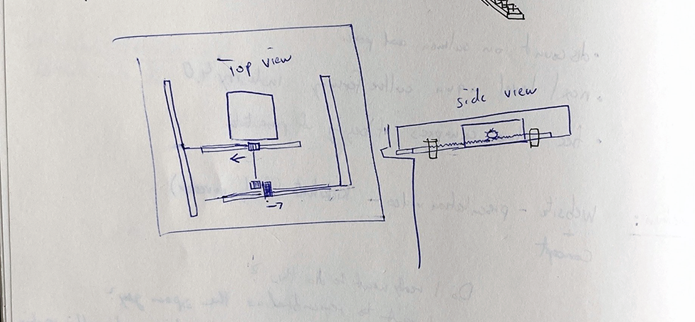
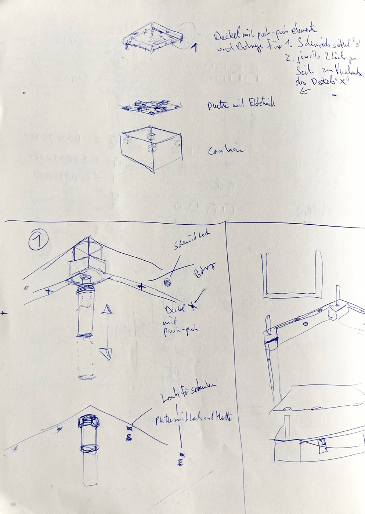

# Delayed Gratification Actuator 

Extended Documentation by Maximilian Wolfs

Course: Digital Artifactual Objections

Lecturer: Prof. Dennis Paul

Term: Winter Term 17/18

## Concept

> Because today's ultra-fast cycle rates being first above being right.
> It tells us what's happening in real time, but rarely what it means.
> Industrial design between extreme pain and pleasure, Asceticism and decadence.

Digital Technology is developing ever faster and is sucking people more and more into a continuous on demand, flexible and dynamic environment. Services and products are delivered faster and Digital Content is almost immediately accessible via cloud based services in the current platform economy. In times of[ *Sofortness*](https://de.wikipedia.org/wiki/Sofortness) the ability of self-control is becoming less used but at the same time more important. How does this shape us and our relation to things and how does the ubiquity of digital services shape our expectations on matter and material culture? I want to examine this question which is mainly situated in a cultural and social sciences in an artistic and experimental approach in an *digital objection* to this high frequency Sofortness economy. In order to examine this question which can be situated in cultural or social sciences I choose an artistic and experimental approach in the form of an *artifact* acting as a *digital objection* to this high frequency Sofortness economy.

The *Delayed Gratification Actuator* is a time capsule, exploring these boundaries between the never satisfied user and the paranoid user suggested by the product, entering a psychological adventure by addressing the darker, conceptual models of need that are usually limited. The Actuator is a monolithic product to examine the relation between things - especially their meaning - to their owners. It consists of a dumb container to put things in and a smart lid with a minimalist interface to set the date when the box will open again in the future. Once it’s closed the control Interface is locked within the container and the only remaining action from outside is to press the top button to see how much time is left, until it will open. The aesthetic appearance of the latest prototype aims to be a monolithic, out of time object with as less ornamental details as possible to evoke a world of fantasy and fiction, blurring distinctions between everyday life and the hyper-reality of advertising and branding.

Standard Product Design has its emphasis on easy pleasure. This object wants to force Aesthetic Disturbance by Design. The intended critical design approach according to Anthony Dunne and Fiona Raby reinforces the status quo – the unfinished. Like a walkman offers different readings of familiar settings, a landscape according to Dunne and Raby, we are surrounded by products that give us an illusion of choice and encourage passivity. Like[ Anthony Dunne and Fiona Raby](http://www.dunneandraby.co.uk/content/home) proposed:

> Electronic products and services could enrich and expand our experience of everyday life rather than closing it down; they could become a medium for experiencing complex aesthetic situations.

The *Delayed Gratification Actuator* tries to focus on how the psychological dimensions of experiences offered through electronic products can be expanded. By referring to the world of product misuse and abuse where desire overflows its material limits and subverts the function of everyday objects, this product would address the darker, conceptual models of need that are usually limited.

* The access of which object do I want to delay in the future? 
* What does the Un-Accessibility produce? 
* How does it change the meaning and relation to myself? What happens when it is present but inaccessible?

The user becomes a protagonist and the designer a co-author of the experience, the product creates dilemmas rather than resolving them. By using the Delayed Gratification Actuator the owner explores boundaries between himself and the paranoid user suggested by the product, entering into a psychological adventure of desire and time. Also putting the object in a state of quantum superposition in the sense of Erwin Schröderinger famous quantum experiment.

In the following documentation I will describe how I was able to transfer this concept into a working prototype and explain the difficulties and decisions on the way. The second major section is a look at the status quo after the final course exhibition and another jury presentation at the Hochschultage 2018 with the main questions how the initial concept did work out and what could be improved. This led to an application to HEC sponsorship which was also the temporary end result until now and sets the frame to draw a conclusion on the whole project.

## Realization – Prototyping and Development

The prototyping and production process involved a lot of going back and forth and produced a lot of enlightening discussions between fellow students, friends and professors. This discursive environment where the studio culture played an important role was the main factor for keeping up the high motivation and was the driving force for continuous improvements with a relatively high frequency of iterations between the other courses and projects. 

In general there were two major threads that were dependent on each other keeping the form always in change and leading to different prototype iterations. This had a huge impact on the technical aspects and made the process highly iterative although easy solutions could have made it much more simple. But they would have also compromised the initial concept in ways that would lead to a standard predictable user experience which make it nothing more than a cheesy 9,99$ one-time fun and tease plastic product. Therefore, it has been very important to strengthen and define the concept throughout the process. It was a delicate thing from the initial presentation in the course and stayed like that through the whole project in discussions, the exhibition, peaking at the Hochschulpreis Jury presentation in 2018 and leading to the temporary end with the 2nd place HEC stipend application.

### Form and Appearence – UX and UI

How should an object for storing things of meaning for a longer amount of time look like? I started to draw and came to the conclusion that it should have a form that is easily accessible. A simple box that locks. This logic resulted in the unofficial working title of the project – *Lox*. Also the interface should be as simple and self-explanatory as possible that the user experience is a no-brainer and *Lox* only a platform for the magic of the self experiment of delayed gratification. I didn’t want it to be a parental punishment tool for locking away smartphones and toys or a specific self-ascetic box. This could well be special editions but the aim in the beginning was a general purpose tool which serves you for an aesthetically psychological desire experiment. These initial thoughts got questioned soon enough.

The material question was an issue throughout the whole project. With the aim of an out of time object that should last and conserve its content forever it was relatively clear that it must be out of metal. Gold or Titanium would be ideal. They are very stable to corrosion, but unrealistic to apply in this project. Bronze seemed to be a good choice as there is a foundry for casting at hfk and its aesthetic would work well for out-of-time aesthetics and also has an art world aura regarding the final course exhibition. Aluminum was in second place as it is significantly cheaper.

But for rapid prototyping there was also the idea of 3D printing. After some research and talks with fellow students who got experience in this technique it seemed also difficult. A first 3D Model with cubic dimensions and 15cm edge length would have taken 24 hours of printing time – for one model. Which also would have been the base for the bronze and aluminum casting. Also I would have to use ABS plastics instead of standard PLA with an post processing with acetone to get smooth surfaces for a smooth cast that doesn’t show artifacts of 3D printing nozzles. With these issues I just started with a wooden model postponing the metal casting question.

How big should it be? What’s the minimum size? For a consumer facing product I thought about doing a survey to come to a decent size. What would you put into a time capsule? But without doing a survey and with an final course exhibition in mind the dimensions were more a decision of manufacturing possibilities and personal taste. The first markup was made by the already described 3D printer which maximum edge length was about roughly 20cm. 

And as for my personal choice I had a strange experience in which I wanted to be able to eat winter cookies in summer, which was not possible due to my lack of objecting to immediate gratification which resulted in eating them already in spring. Therefore, the interior of the container matched exactly two 600g packs of Gewürzspekulatius. This choice should also play a role in the presentation of the project in the first exhibition.

The next design decision to make was how the locking mechanism integrates with the material. A classic treasure box consists of two parts, integrated together by at least two hinges. I did some research on the history about treasure boxes and the time where in most cases the lid is ultimately attached to the container. The other option was a lid and a container that are two separate parts, but with a much more complex and demanding solution to find how to integrate the locking mechanism and how to open it.

After a lot of thoughts, discussions and sketches I created the first CAD mode in Fusion360 to have a starting point for the production of the first prototype especially with the wood and metal workshop to discuss something feasible. I went for the two part solution because I wanted a surface that is as smooth as possible without any hinges or outer profiles that show any rough mechanisms. Another reason was that without hinges there won’t be any uneven profile at the surface to open the box illegally with some easy violence. Of course you can break it totally, but then you would also have to harm your valuable content.

This resulted in two separate parts. A dumb container for storing things and a smart lid with the whole electronics and the interface. This two part solution could also be a nice possibility for later interchangeable customization in different materials of containers.

### 

### First Prototype – Iteration 1

The first wooden model was manufactured out of cheap MDF in only one hour in the wood workshop to get a first feel for the dimensions. What can I put into it? One finding was that the thickness of the material is too thin for the feeling of a solid box that locks something away for centuries. It had to be thicker.

### Electronic Modules and Program Code

With a first Rendering, form factor model, a User Experience concept, a sketch for the user interface there was something to grasp. The next step was to break down the rough User Flow into the components in the lid and the program itself. I needed:

* a display for editing and showing the date and countdown 

* a microcontroller managing all the proceduresa frontside push button for activating the display
* a rotary encoder push 
* button a real time clock module for having exact dates that are not dependent on the bad timing of the microcontroller
* a good power management
* a locking mechanism
* an opening mechanism

I started coding with writing pseudo code in my notebook: 

The Program has two main cycles which act as two different states. Is the timer set? If it is, it implies the lid is closed and the user can only press the top button. Once it is pressed, an interrupt is fired and the micro controller wakes up from the energy saving deep sleep and connects to the real time clock module and asks the current time to calculate the remaining time to the date set by the user. Then the display shows the remaining time of 20 seconds. When the display is cleared the micro controller goes back to deep sleep. When the celebration date is reached the microcontroller does nothing. Only when the date set by the user is overdue, the timer will be resetted and the code jumps into the celebrate function, which results in a little screen animation and activating the Solenoids. The user is present and can now press down the lid, which opens up. The solenoid will close again but miss their holes, which enables the user to pull out the whole lid and makes the content and interface rotary encoder on the bottom of the lid accessible. 

The program is now in its second state – timer not set. It is now possible to push the rotary encoder and set the date for opening the Lox in a future date. Once set, the solenoids suck in, letting the user push the lid into the container. When the solenoids push back and the lid is back in the container the Lox is closed and switches the state into TimerIsSet.

[Link to the Program Code](https://github.com/maxwolfs/Delayed-Gratification-Actuator/tree/master/code/Lox_0.2.ino)

The difficulty was to think algorithmically without a lot of experience in design patterns regarding embedded systems. As with having only experience with reverse engineering in my prior project Crude Data and web development projects, it was hard to research, design and implement the different parts, specifications and libraries to fit it into my concept to become the Delayed Gratification Actuator.

### Locking Mechanism

With the code being able to set a date, show the remaining time and calling the final function which executes the unlocking mechanism. It was finally time to decide on the mechanism itself. Fortunately I already have a tested Solenoid Driver Circuit from the sound course I’m taking so that I could easily adapt the Mosfet Circuit into the Lox.

In an individual meeting Prof. Dennis Paul suggested a servo motor instead that is driving a gear wheel that’s connected to a four axis mechanism which is pulling in and thus releasing the lock. It is super nice and smart to use only one motor instead of four or two solenoids. 

Nevertheless, there were two things which I was not convinced by this solution.

1. It takes too much space on the inside of the lid. Especially the positioning of the main gear wheel isn’t possible with the layout of display and the top button. It would have meant to use two layers in the Z dimension. The lid would be really thick then and/or resulting in a more complex construction.
2. The sound a servo motor is producing is awful. Its high pitch sound induces the feeling of cheap radio controlled toys. Imagine you lock something away for 20 years and then you hear this. No! It must definitely have another sound that connects to a more sublime sonic experience. The solenoids are cool because their sound of knocking against the wall of the container hiding the things is a nice metaphor too.

But with the decision of solenoids there was the question which one to take that matches my specs of power and are even able to activate the push-push-actuators to open the lid. Solenoids are hard to get and aren’t that cheap. So I basically bought almost every solenoid on Ebay and Amazon available to try them.

### Opening Mechanism

A big question was coming up again and again. How will the opening mechanism actually work? There were a few suggestions that it could be opened with a top handle or carved out holes. But I want to stick with the clean and flat design.

After thinking it over and over I was holding my pen and clicking it while thinking about it. There it was! The pen mechanism: A push-push element as known in drawers. You push them to open and push again to close it and it will stay in its position. 

I ordered the cheapest ones from IKEA, but unfortunately they were too big. The springs need too much force and the travel of the springs with 80mm was too long to fit in the housing. Custom made solutions were too expensive for a prototype. After thinking for quite a while I thought that it could exploit the mechanism out of pens. I did a few trips to office stores and tested every pen I could find, but there weren’t suitable ones that matched the requirements, mostly the force of momentum.

Then I finally found a rotary push encoder from a test package that came with the EC11 encoders. Perfect! Enough force, decent spring range and small form factor.

Although It worked perfectly well, I wasn't quite satisfied with the perspective of a solution that has not a real perspective for producing a small series of more boxes because of the solution being too "hacky". I applied the new measurements and new positions of the parts to a second drawing and produced a second model where I also switched from Fusion360 to Autodesk Inventor, which allowed me to change dimensions parametrically more easily than in Fusion360 - especially of linked values.

I also worked a lot in the Institute of Technical Education at the University of Oldenburg because of their new and advanced Laser Cutter which can process materials with 20mm thickness and a nice wood workshop infrastructure to assemble and test the different sizes.

### Working Prototype – Iteration 2

Besides the opening mechanism another big challenge was the power management and its accessibility. For this prototype two standard AA battery cells were enough and also had a good availability today and in a mid-term unknown future. 

The lift mechanism is working beautifully! Especially the sound of clicking when opening gives you a nice feeling of quality. It actually makes fun like random clicking on pens. But the biggest insight was, it works mechanically. But I was already thinking of removing the suboptimal battery pack solution.

[VIDEO OF ITERATION 2 PROTOTYPE WITH INTERACTION](https://www.youtube.com/watch?v=wyVM1x2QQp0&)

### Major Update – Iteration 3

For the next prototype I made again some major improvements. I built two from which one transformed into the final exhibition version. The former solenoids didn't have enough travel to keep the lid locked in its wooden container. I switched to bigger solenoids, which needed more power and were heavier. So I also switched from four to two, which were still enough. But they needed a bigger supply voltage which made it necessary to use four battery cells instead of four and an additional step-up converter which also resulted in a more complex, heavier and more expensive circuit. But it still worked out pretty well with far more solid solenoids and a better working locking mechanism and more satisfying sound.

It was also necessary to have thicker sides of the container for the solenoid pins to dive into. All in all the wooden construction had to be built very precisely in order not to tilt with the lid. Wood was now 12mm poplar with the container and 4mm poplar with the lid enclosure.

And as seen in the now little bit tidied up smart lid, I was still working with jumper cables. It was still messy and  prone to wire connection issues. I also glued the components to the bottom. At that time I didn't know anything about pcb design but it soon came on my list of improvements.

As the original idea was to make the final exhibition version a bronze cast or at least out of metal I faced my material issues in an intensive one hour meeting with Prof. Peter von Maydell. We discussed every possible manufacturing solution he could think of. Welding, injection moulding, different 3D printing methods, welding, cold drawing with metal plates, casting out of concrete and of course possible wooden techniques. It was a big pro and con discussion which resulted in wood being the most affordable and accessible material for the whole prototyping process.

Another topic that came up again was power management. The increase in space and weight was still manageable for the springs in the opening mechanism but it would be against my initial approach of a smooth surface to have them accessible on the top of the surface. So I needed a rechargeable solution instead of the user changing the batteries from the top. The solution here was an USB-C outlet and a charging circuit. As I already had AA battery packs I switched to long lasting and stable Ni-Mh cells. The USB-C socket also had the advantage that it has nice dimensions that suit the design, look far better than any USB connector and would be quite common in the future. 

Due to the fact that the standard was relatively new there were not a lot of components available at mouser. Specifically I needed a power only wired 90° turned pcb socket connector. This was quite common and available for micro USB but not already for the USB-C standard. So I tried to reverse engineer adapters but due to their length and cable chaos it was too hacky to apply it to my design. I decided to wait for the parts to be available to implement it later and use a small reset hole I could access for the upcoming exhibition version.

### Exhibition Version – Iteration 4

In order to avoid the DIY laser cut look which pushes the whole box into a maker context I wanted to have at least a surface that supports the aesthetic of an out of time artifact. As mentioned earlier, aluminum and bronze casting was too expensive and imprecise I ended up with a bronze Coating made out of epoxy and real bronze powder, which I applied to the surface. 

The process was really complicated and time consuming, especially the treatment of the final bronze surface with sanding and polishing. But the result was quite good and it looked perfectly as if the whole body was made out of bronze. Also the tactile feeling was cold and hard. – It actually is a very thin layer of bronze. As the object was not meant to be held or lifted it was a perfect method not having to spend several hundred euros for 10kg of bronze in the foundry.

[VIDEO OF THE EXHIBITION VERSION IN INTERACTION](https://vimeo.com/238361982)

## Status Quo – Reality Check

The project has been exhibited twice. First it was part of the group exhibition [Digital Artifactual Objections](http://dao.digitalmedia-bremen.de/) at FAQ Gallery in Bremen. The second one was at Hochschultage 2018 at the University for the Arts Bremen. In both settings the appearance of the work was aimed towards an out of time artifact with the performative aspect that the timer would end at a specific time. It worked out surprisingly well at FAQ, that almost all 20-30 persons were entering the space and approaching the setup to see what would happen. As a reference for where the original idea came from, the content was an unopened pack of Gewürzspekulatius, which was then opened and consumed. The exhibition was nice but from the conceptual point of view it didn’t really reverberate with the original main concept. As a reference for where the original idea came from, the content was an unopened pack of Gewürzspekulatius, which was then opened and consumed. 

With the second exhibition at HST 2018 with a jury presentation these findings were amplified. After I introduced and presented the project like in this introduction I was confronted with the question by the current curator of the Edith-Ruß-Haus for Media Art that such an object, a safe with a time lock, does already exist on the market and why I build something that’s already there*.* My concept and narrative did not really connect to what I haved aimed for in both exhibition settings. What went wrong?

This led me to the insight that the gap between the concept and narrative of a critical design related everyday object and its physical representation of the last prototype in the exhibition version as an out-of-time art object seems too big. It just did not work. A critical design everyday object prototype in the shape of art object in an exhibition opening of an art school. The staging was a misleading event to a surprise effect which was fun in an actual exhibition setup which dramaturgy is often a predictable and equal collection of sequencing that lead from speeches, networking, buffet to drinking. But there was just no link to the initial concept, which had to be changed. So another iteration was needed.

The aim was to get a small batch of five prototypes to distribute them to people for a user testing. For this I wanted to push to the current prototype to a level where all parts are finalized to iterate the production of more units. From a bronze and arty aesthetics to a more simple consumer facing approach. But I was now facing two issues after the Hochschultage late February: time and money. New courses, especially the big master project would start and others needed some attention and budget in finishing as well. So I had the plan to link the further development of the project or the next iteration of it to the outcome of my application to the HEC sponsorship where my plan was:

* to resolve mechanical issues and produce a viable prototype for easy reproduction,
* to produce a small batch for pilot testing within the field,
* hand it to pilot testers and evaluate the user stories.

With the test phase I wanted to examine the role of the users and the experience with the object. The planned budget for PCB production, components and wood were a total of 1130€. My Roadmap as stated in my HEC Sponsorship application looked like this consisted of three phases:

| Month | ToDo                                                         |
| ----- | ------------------------------------------------------------ |
| 1 – 2 | finding the final form and improvements: push-push actuators, locking & opening mechanism, pcb layout & parts |
| 3 – 4 | production of five prototypes                                |
| 5 – 6 | user testing and evaluation                                  |

The user testing in the field should approach the three main question:

* What is being locked away in which time frame?
* Which narratives are being developed?
* How does the absence of specific material objects shape their relation to them?

## Conclusion

A strong belief and passion throughout the project kept up the essential momentum and intrinsic motivation for a result – the working materialisation of an idea. The foundation for this was the people and environment of discussing, precisely the talks with workshop leaders, professors and most important my fellow students in the fantastic studio culture.

A project like this needs different disciplines and knowledge to come together. From construction methods, material parameters, tools, programming, libraries to electronic components. It’s complicated and complex. Everything must be exact in order to fit together. Custom solutions require thinking outside the box. The electronics part was especially new for me and had a steep learning curve. I relied heavily on the know-how of others which I had to acquire and apply. Researching a lot of open source libraries and modules like how does an exact time measurement work with embedded systems was super specific and interesting at the same time. Getting strange faces from the shop owners at the local electronics like WIDI-Elektronik who didn't want to sell parts or angry answers on microcontroller.net forum were also nice parts of this endeavour.

But the most interesting insight occured on the conceptual level: An idea can be very good and promising in talks and discussions, but the final implementation still needs exposure to uninitiated people to find out how it actually works. This experience is very important as it is rather unimportant what a creator originally planned how something should work. An issue which is most common in the arts but also in the world of engineering. If something is interpreted differently by the recipients than it was actually meant or conceptualized by the artist or creator you often hear responses like “it is supposed to work like X” or “it means Y”. But once an object is released to the public it lives for its own and for everyone differently. Therefore, it is important to overcome your self-centeredness as a creator who thinks to own the hegemony of meaning instead of listening and observing carefully how people react in situations of exposure.

I hope I will be able to continue this project in a not so distant future when time and money are available again to dive in deeper in this exciting process. Going through it until now with all ups and downs was very intense. From sleepless nights at home or in the studio to endless learnings. The intensiveness of this project constitutes my motivation for this program and thus, continue to develop further projects. The ability to be in an environment and culture which enables one to pursue ideas and make them reality is an invaluable experience that encourages enormously to learn and continue.

Thanks to all the people who listened to me and came up with advice and support that made this possible! 
